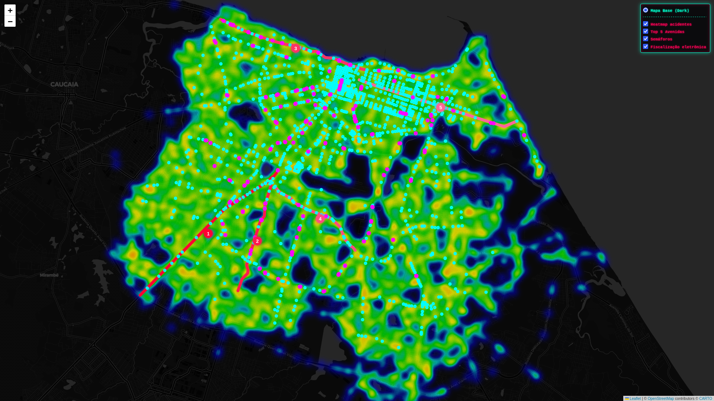
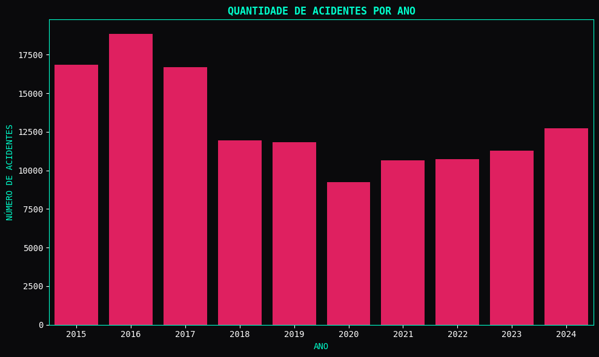
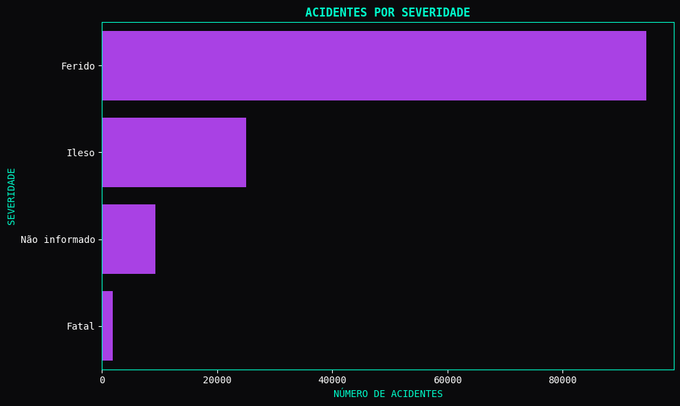
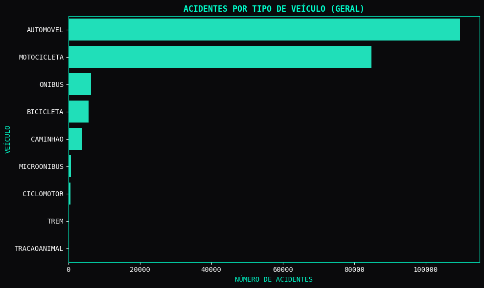
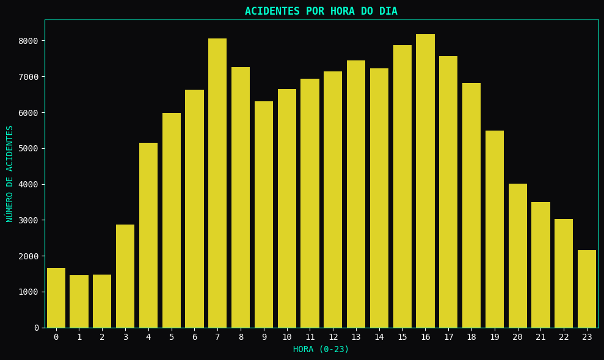
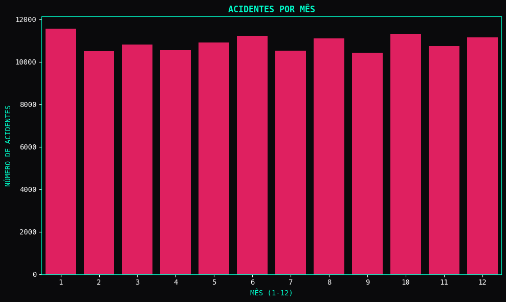
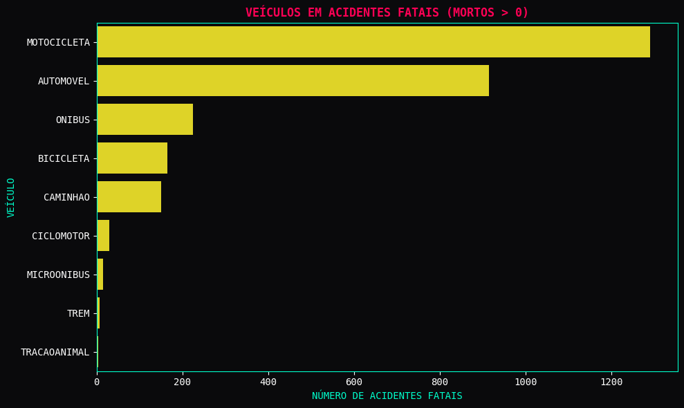

# Análise de Dados de Sinistros em Fortaleza (2015-2024)

Este projeto apresenta uma análise abrangente e visual dos dados de acidentes de trânsito (sinistros) ocorridos na cidade de Fortaleza entre os anos de 2015 e 2024. O objetivo é fornecer insights claros sobre padrões de segurança viária, combinando visualizações cartográficas interativas e análises estatísticas.

Os dados utilizados são provenientes da **AMC (Autarquia Municipal de Trânsito e Cidadania de Fortaleza)**, o órgão responsável pela gestão do trânsito na capital cearense.

---

## 📂 Datasets Utilizados

A análise foi construída cruzando quatro fontes de dados distintas:

1.  **Sinistros de Trânsito (2015-2024):** O conjunto de dados principal contendo o registro de todos os acidentes georreferenciados.
2.  **Dados Abertos - Semáforos:** Localização de todos os semáforos controlados pela CTAFOR.
3.  **Dados Abertos - Equipamentos de Fiscalização Eletrônica:** Localização dos radares e câmeras de fiscalização em operação na cidade.
4.  **Curadoria das 5 Avenidas Mais Perigosas:** Um arquivo geoespacial criado especificamente para este projeto, mapeando os trechos das cinco avenidas com o maior histórico de acidentes em Fortaleza.

---

## 🖥️ Resultado Final: Mapa Interativo

O principal produto deste projeto é uma página HTML interativa que permite ao usuário explorar visualmente a infraestrutura de trânsito e a densidade de acidentes sobrepostas. Através de um controle de camadas, é possível filtrar o que você deseja visualizar.

A página conta com as seguintes camadas:
* **Camada de Heatmap (Mapa de Calor):** Mostra a concentração de acidentes (sinistros) na cidade.
* **Camada de Semáforos:** Pontos azuis indicando a localização dos semáforos.
* **Camada de Fiscalização Eletrônica:** Pontos magenta indicando os radares.
* **Camada das 5 Principais Avenidas:** Destaca os trechos específicos das avenidas com maior índice de acidentes.

---

## 📊 Análise Gráfica dos Sinistros

Além da cartografia, foram realizadas diversas análises estatísticas para entender o perfil dos acidentes em Fortaleza durante a última década. Abaixo estão as visualizações detalhadas:

### Graph 1: Quantidade de Acidentes por Ano (2015-2024)
Esta visualização mostra a evolução histórica do número total de acidentes registrados na cidade ano a ano, permitindo identificar tendências de aumento ou redução.

### Graph 2: Quantidade de Acidentes por Severidade
Este gráfico distribui as ocorrências de acordo com a gravidade das consequências, separando acidentes com feridos, fatais, e aqueles apenas com danos materiais ou "Não informados".

### Graph 3: Quantidade de Acidentes por Tipo de Veículo Envolvido
Uma visão geral de quais tipos de veículos (automóveis, ônibus, motocicletas, bicicletas, etc.) estão mais frequentemente presentes nos registros de acidentes.

### Graph 4: Quantidade de Acidentes por Hora do Dia
Esta análise identifica os horários de pico de ocorrências, mostrando como os acidentes se distribuem ao longo das 24 horas do dia.

### Graph 5: Quantidade de Acidentes por Mês
Mapeamento da sazonalidade dos sinistros, revelando quais meses do ano historicamente concentram mais acidentes em Fortaleza.

---

## 💡 Insight Principal: O Mito das Motos e a Realidade Fatal

Em Fortaleza, existe uma percepção comum de que as motocicletas são veículos perigosos. Mas será que essa percepção condiz com a realidade dos dados fatais?

Para responder a isso, filtramos apenas os acidentes que resultaram em **pelo menos um óbito** (Severidade: Fatal ou Mortos > 0) e analisamos a distribuição por tipo de veículo. O resultado é alarmante:

**A conclusão é inegável:** A motocicleta é, de longe, o veículo com o maior envolvimento em acidentes fatais na cidade de Fortaleza, superando amplamente automóveis e outros modos de transporte. Os dados confirmam que a moto real é o veículo mais fatal na nossa realidade viária.

---
